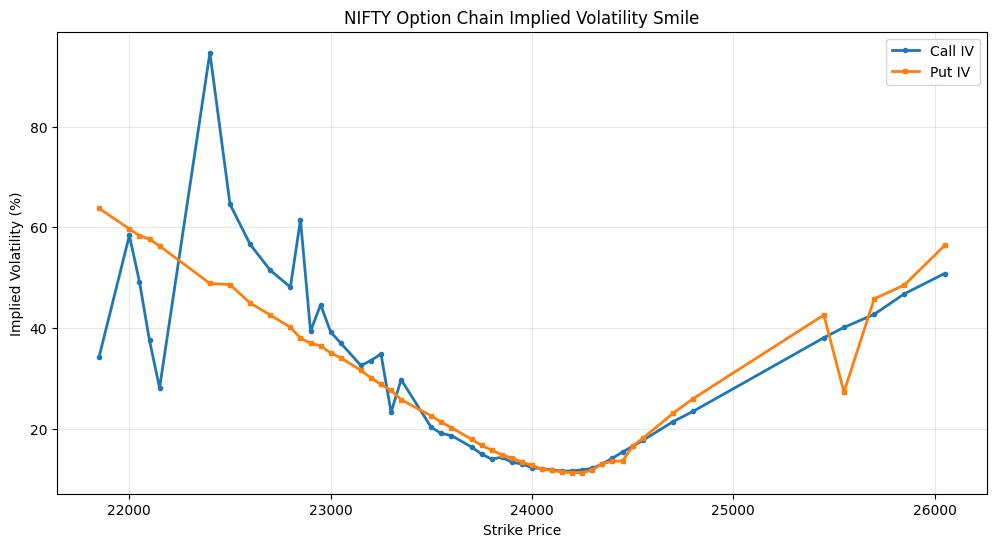

# Quantative_Option_Chain_Analytics_Nifty_23_06_2026

# Motivation of this project 
* option chain analysis for collective market expectations.
* Open intreset reveals trader positing for long term as well as short term analysis
* Implied volatility reveals the uncertainity.
* Put/Call behaviour show resistance as well as support for the underlying assets.
--
## Some financial glossory:
**Strike Price :** The specific price at which the buyer can buy (call option) and sell (put option) the underlying market asset. The market's current price usually sits in the middle, dividing in-the-money (ITM) and out-of-the-money(OTM) strikes. 

**Call Open Intreset (OI) :** The total number of outstanding call contracts currently active. HIgh call OI shows a strong resistance level. 

**Call Change OI** : The total change in OI during a trading session tells us above of upcoming resistance/support.

- **Call Volume** : The total number of call contracts traded duing the current trading session, showing the most actively traded strike price. 

**Call IV - Implied Volatility** - A measure of the expected future volatility of the underlying asset. Higher IV shows higher option permiums. 

**Call LTP (Last Traded Price) :**   Current price of the market premium you need to pay to buy a call option at that strike price.

> Similarly we have put side glossary as : 

**Put OI (Open Interest) :** The total number of outstanding put contracts. High Put OI typically highlights a strong support level.

**Put Change OI:** The net change in open interest for that specific put strike during the day.

**Put Volume:** The total number of put contracts traded today.

**Put IV:** The implied volatility for the put option.

**Put LTP:** The current premium you would pay to buy a put option at that strike.

<h1> Dataset Description</h1>

**Source** - NSE Option Chain 
**Underlying Asset** - NIFTY 50
**Expiry Date** - 23 June 2026

<h1> Data Cleaning </h1>

- step 1 - Rename the columns for call and put options.
- step 2 - Rename duplicated header row for better reading.
- step 3 - replace '-' with NaN using 'numpy'.
- step 4 - convert string (10,550) into numeric value using new function.
- step 5 - Validation of the data.

## Summary Table 

|Metric        |Strike |Value    |Interpretation                 |
|--------------|-------|---------|-------------------------------|
|call_oi       |24200.0|205342.0 |Potential Resistance           |
|put_oi        |24000.0|202239.0 |Potential Support              |
|call_change_oi|24150.0|101025.0 |Maximum New Call Positions     |
|put_change_oi |24100.0|116663.0 |Maximum New Put Positions      |
|call_volume   |24100.0|7560987.0|Most Active Call Trading       |
|put_volume    |24100.0|8010738.0|Most Active Put Trading        |
|call_iv       |22400.0|94.67    |Highest Call Implied Volatility|
|put_iv        |21250.0|77.91    |Highest Put Implied Volatility |

# Reserach Findings : 
## Market position cluster :
The most option activity is concentrated between 24000-24200 region.

## Support Zone : 
Larger Put Open Intreset : 24000 

Put writers are concentrated at 24000, this strike act as a support zone. 

## Expected Trading zone : 
The expected trading zone is 24000 to 24200; Most common option-chain 

## New position Creation :
call_change_oi = 24150
put_change_oi = 24100

The fresh position are being created near the current market consensus zone. Trader are actively adjusting their position near 24100-24150 due to expiry of market is near by. 

**24100** is the most actively traded strike.

The highest call and put trading volumes are observed at a strike price of 24100 strike, suggesting that this this is the main battleground between bullish and bearish market participants where market is closed near by this price. 

**Highest Call Implied Volatility** and **Highest Put Implied Volatility** are observed at strikes far from the primary trading region, consistent with the volatilty observed in option markets. 

## Call Put Ratio
To gauge the market sentiment Put-Call Ratio (PCR) was computed using total open interset across all strikes which is defined below: 

$$
PCR = \frac{\text{Total Put OI}}{\text{Total Call OI}}
$$

And we found out PCR = 0.8716758967048529 which shows "**Market is slighlty bearish.**" based on following framework : 

| PCR       | Interpretation     |
| --------- | ------------------ |
| < 0.7     | Bearish            |
| 0.7 – 1.0 | Slightly Bearish   |
| 1.0 – 1.3 | Neutral / Balanced |
| > 1.3     | Bullish            |
| > 1.5     | Extremely Bullish  |

## Concentration Ratio:

$$
\text{Concentration Ratio} = \frac{\text{Top 5 OI}}{\text{{Total Oi}}}
$$

Show us the quantative metric of position where we used following critrion for market analysis

| Ratio  | Meaning                |
| ------ | ---------------------- |
| <20%   | Diffuse positioning    |
| 20–40% | Moderate concentration |
| >40%   | Strong concentration   |
| >60%   | Extremely concentrated |

## Results

|      |Metric|Top5_OI|Total_OI     |Percentage| 
|------|------|-------|-------------|----------|
|0     |Call OI concentration|853830.0  |2559036.0|33.365298|
|1     |Put  OI concentration|745974.0  |2230650.0|33.442001|

The top 5 call and put strikes accounts for about 33\% of the total call open interest indicating that market positioning is moderately concentrated around a small number of strikes showing good consensus among traders. 

Top 5 call Strikes : 
|index|strike|call_oi|
|-----|------|-------|
|60   |24200.0|205342.0|
|58   |24100.0|171128.0|
|62   |24300.0|162409.0|
|66   |24500.0|159722.0|
|59   |24150.0|155229.0|

Top 5 put Strikes : 
|index|strike|put_oi|
|-----|------|------|
|56   |24000.0|202239.0|
|58   |24100.0|166651.0|
|54   |23900.0|126352.0|
|52   |23800.0|125569.0|
|46   |23500.0|125163.0|

One observation we made that most of the top OI is concentrated around 24000 and 24200 

**Weighted Variance and Weighted Standard Deviation Results :**

|index|Metric                     |Value             |
|-----|---------------------------|------------------|
|0    |Wighted Variance           |280551.31820609374|
|1    |Weighted Standard Deviation|529.6709527679366 |

The miniumum value of strike is **21200** and max value of **26300** with a **weighted mean strike of 24596**. We find out a **Weighted Standard Deviation to be 529.67**. 

\href{https://en.wikipedia.org/wiki/Volatility_smile}

**Volattility Smile in Option Trading:**
Volatility Smile are implied volatility patterns that arise in pricing financial options a parameter that needs to be modified for the Black-Scholes formula to fit market prices. 

|IV Summary Statistics |         |        |  | ||
|---|---------------------------|------------------|---------|---------|------|
|   |Metric                     |Call              |IV       |Put      |IV    |
|0  |Mean                       |IV                |30.562083|29.782708|      |
|1  |Median                     |IV                |25.790000|26.640000|      |
|2  |Std                        |IV                |18.443256|16.108505|      |
|3  |Min                        |IV                |11.590000|11.290000|      |
|4  |Max                        |IV                |94.670000|63.760000|      |
|Maximum IV Summary |                         |           |         |         |      |
|   |Metric                     |Strike            |IV       |         |      |
|0  |Maximum                    |Call              |IV       |22400.0  |94.67 |
|1  |Maximum                    |Put               |IV       |21850.0  |63.76 |
|Top 5 Call IV Strikes|                          |             |       ||      |
|   |strike                     |call_iv           |         |         |      |
|24 |22400.0                    |94.67             |         |         |      |
|26 |22500.0                    |64.58             |         |         |      |
|33 |22850.0                    |61.52             |         |         |      |
|16 |22000.0                    |58.40             |         |         |      |
|28 |22600.0                    |56.62             |         |         |      |
|Top|5  Put IV Strikes                       |               |       |  |      |
|   |strike                     |put_iv            |         |         |      |
|13 |21850.0                    |63.76             |         |         |      |
|16 |22000.0                    |59.69             |         |         |      |
|17 |22050.0                    |58.33             |         |         |      |
|18 |22100.0                    |57.67             |         |         |      |
|97 |26050.0                    |56.40             |         |         |      |

Both the curve reaches their minimum around 24000-24200 which is where maximum Call and Put OI resides. 
* Minimum IV =  24000-24200
* The lowest implied volatility occurs near the strikes with the highest concentration of OI. This suggest that market that market traders assign the highest prob to the price movements occuing within this region.
* Far away from 24100 IV increases dramatically. Options far from the primary trading region exhibit substantially higher implied volatility, reflecting greater uncertainty and lower liquidity.
* The graph is left side skew ; Call IV Max = 94.67; Put IV Max = 63.76; 
